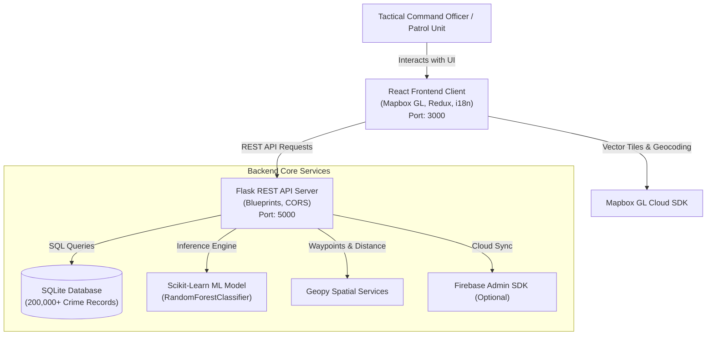

# 👁️ TRINETRA AI - Predictive Policing & Crime Mapping Platform

---

## 🎯 Project Aim & Vision

**Trinetra AI** aims to revolutionize law enforcement and public safety operations by transitioning police departments from **reactive crime response** to **proactive, data-driven predictive policing**. 

Named after the mythical all-seeing third eye (*Trinetra*), the platform provides intelligence officers, police chiefs, and tactical units with a unified spatial-temporal intelligence command center. By combining machine learning, high-performance GIS visualization, and automated route planning, Trinetra AI empowers law enforcement to anticipate criminal activity, deploy patrol units efficiently, and make informed strategic decisions to keep communities safe.

---

## 🚨 The Real-World Problem Being Solved

Modern law enforcement agencies around the world face critical operational hurdles that hinder effective crime prevention:

1. **Reactive vs. Proactive Policing**: Traditional police strategies rely heavily on responding to emergency calls after a crime has occurred, missing vital opportunities for crime deterrence and intervention.
2. **Sub-optimal Resource Allocation**: Police departments operate under tight personnel schedules, vehicle availability, and budget constraints. Random or unguided street patrols often result in wasted fuel and coverage gaps in vulnerable areas.
3. **Data Silos & Information Overload**: Law enforcement agencies collect vast amounts of First Information Reports (FIRs) and historical incident logs (hundreds of thousands of records). However, this data remains buried in tabular files or legacy databases without automated spatial-temporal analysis.
4. **Lack of Real-Time Geospatial Intelligence**: Tactical decision-makers often lack real-time map visualization to identify emerging crime hotspots, risk trends, and high-density incident clusters across different states, districts, and time windows.

---

## 💡 How Trinetra AI Solves It (In-Depth Technical Solution)

Trinetra AI addresses these real-world challenges through a multi-tiered, intelligence-led technology stack:

### 1. 🤖 Predictive Threat Intelligence Engine (Machine Learning)
- **Problem Solved**: Eliminates guesswork in identifying when and where crimes are likely to occur.
- **How It Works**: Trinetra AI integrates an ensemble `RandomForestClassifier` trained on over **200,000+ historical crime records** across India. By analyzing key spatial-temporal variables—such as latitude, longitude, hour of day, day of week, month, and location category—the ML engine calculates real-time **crime risk scores (Low, Medium, High, Critical)**, predicts probable crime categories, and estimates threat probabilities for any requested coordinate and time window.

### 2. 🚔 AI-Optimized Patrol Route Generator
- **Problem Solved**: Maximizes police visibility in high-risk zones while minimizing patrol transit time and fuel consumption.
- **How It Works**: The backend features a spatial routing service built with **Geopy** and custom multi-waypoint optimization algorithms. Given a patrol origin (police station/checkpoint) and coverage radius, the system dynamically queries high-risk crime hotspots and calculates the optimal sequence of patrol waypoints. Officers receive step-by-step route directions prioritized by threat severity.

### 3. 🗺️ High-Performance GIS Mapping & Spatial Clustering
- **Problem Solved**: Converts overwhelming tables of crime data into clear, actionable geospatial visual intelligence.
- **How It Works**: Powered by **Mapbox GL JS**, the frontend renders dynamic point clustering and heatmaps capable of processing tens of thousands of coordinates smoothly. Command officers can interactively filter incidents by date, crime classification, severity level, or region, instantly exposing hidden crime corridors and spatial patterns.

### 4. 📝 Digital FIR Management & Database Synchronization
- **Problem Solved**: Streamlines First Information Report (FIR) filing and seamlessly feeds incident data into analytics pipelines.
- **How It Works**: The integrated digital FIR workflow allows officers to record incidents with full metadata (location, time, type, status, suspect details). Newly submitted FIRs are stored in a high-capacity **SQLite database (`crime_data.db`)**, immediately updating spatial maps and serving as fresh training data for model retraining pipelines.

### 5. 📊 Command Center Analytics & Tactical Dashboard
- **Problem Solved**: Gives senior leadership a birds-eye view of state-wide and nationwide crime trends.
- **How It Works**: The analytics suite compiles state-wise breakdown charts, monthly volume histograms, solved vs. pending case rates, and risk category distributions. Coupled with **i18next multi-language support (English/Hindi)** and a low-glare **dark tactical mode**, the interface is optimized for round-the-clock command center monitoring.

---

## 📜 Table of Contents

- [🏗️ System Architecture](#️-system-architecture)
- [✨ Key Features Summary](#-key-features-summary)
- [🛠️ Tech Stack](#️-tech-stack)
- [📂 Project Directory Structure](#-project-directory-structure)
- [🚀 Quick Start & Installation](#-quick-start--installation)
  - [Prerequisites](#prerequisites)
  - [1. Backend Setup (Flask Server)](#1-backend-setup-flask-server)
  - [2. Frontend Setup (React Client)](#2-frontend-setup-react-client)
- [⚙️ Environment Variables](#️-environment-variables)
- [🤖 Machine Learning Model Details](#-machine-learning-model-details)
- [🔌 API Reference](#-api-reference)
- [📊 Database & Dataset Integration](#-database--dataset-integration)
- [🌐 Internationalization & Themes](#-internationalization--themes)
- [🔍 Troubleshooting & FAQ](#-troubleshooting--faq)
- [🤝 Contributing](#-contributing)
- [📄 License](#-license)

---

## 🏗️ System Architecture



---

## ✨ Key Features Summary

- 🗺️ **Interactive GIS Crime Mapping**: High-performance Mapbox GL rendering with dynamic point clustering, crime severity heatmaps, and spatial bounding box queries.
- 🤖 **AI Crime Prediction & Hotspot Scoring**: `RandomForestClassifier` estimating risk level (Low/Medium/High/Critical) and crime probabilities for targeted spatial coordinates.
- 🚔 **Smart Patrol Route Optimization**: Multi-waypoint route planner using spatial algorithms and Geopy to generate optimized patrol routes through high-risk areas.
- 📊 **Real-time Analytics Dashboard**: Interactive graphs for state-by-state crime distributions, temporal trends, category breakdowns, and monthly histograms over a 200,000+ record dataset.
- 📝 **Digital FIR Management System**: Incident logging, search, filtering, and status tracking integrated with SQLite database synchronization.
- 🌐 **Multi-Language Support (i18n)**: Instant language switching (English & Hindi) powered by `react-i18next`.
- 🌓 **Dynamic Theme Switching**: Tailored dark and light mode UI options for high-contrast viewing in tactical command centers.

---

## 🛠️ Tech Stack

### **Frontend (`Trinetra-AI-Client`)**
- **Framework**: React 18 (SPA Architecture)
- **State Management**: Redux Toolkit & React Redux
- **Maps & GIS**: Mapbox GL JS, Mapbox SDK, Mapbox Geocoder, Leaflet
- **UI Components & Icons**: Tailwind CSS, Lucide React Icons
- **HTTP Client**: Axios
- **Internationalization**: i18next & react-i18next

### **Backend (`Trinetra-AI-Server`)**
- **Framework**: Python 3.8+ / Flask 3.0+ & Flask-CORS
- **Machine Learning**: Scikit-Learn (`RandomForestClassifier`), NumPy, Pandas, Joblib
- **Database**: SQLite (`crime_data.db`) storing 200,000+ national crime records
- **Spatial Calculations**: Geopy (geodesic distance calculations)
- **Cloud & Auth**: Firebase Admin SDK (Optional)

---

## 📂 Project Directory Structure

```
TRINETRA AI/
│
├── LAUNCH_GUIDE.md               # Step-by-step launch & execution instructions
├── README.md                     # Comprehensive project documentation
│
├── Trinetra-AI-Client/           # Frontend React Application
│   ├── public/                   # Public assets & HTML template
│   ├── src/
│   │   ├── components/           # Reusable components (Maps, FIR forms, Navbar)
│   │   ├── hooks/                # Custom React hooks
│   │   ├── i18n/                 # Translation files (English, Hindi)
│   │   ├── pages/                # Views (Dashboard, Map, Analytics, Patrol, FIR)
│   │   ├── redux/                # Redux store slices & actions
│   │   ├── services/             # Axios API services
│   │   ├── App.jsx               # App routes & main wrapper
│   │   └── main.jsx / index.js   # React bootstrapper
│   ├── package.json              # Dependencies and run scripts
│   └── .env                      # Frontend environment configuration
│
└── Trinetra-AI-Server/           # Backend Flask Application
    ├── data/                     # CSV dataset & SQLite database (200k+ records)
    │   ├── crime_data.db
    │   ├── india_crime_dataset_200k.csv
    │   └── import_dataset.py
    ├── models/                   # Serialized ML model binaries (.pkl)
    ├── routes/                   # Flask API Blueprints
    │   ├── analytics.py          # Summary metrics & trend endpoints
    │   ├── crimes.py             # Incident queries & heatmap endpoints
    │   ├── patrol_routes.py      # Route optimization endpoints
    │   └── predictions.py        # ML risk prediction endpoints
    ├── services/                 # Business logic, ML inference, DB management
    ├── utils/                    # Utility functions & input validators
    ├── app.py                    # Flask application factory & entrypoint
    ├── config.py                 # Environment configuration classes
    ├── train_model.py            # Model training & serialization script
    └── requirements.txt          # Python dependency list
```

---

## 🚀 Quick Start & Installation

### Prerequisites

Ensure you have the following installed on your system:
- **Python 3.8+** (with `pip`)
- **Node.js 14+** (with `npm`)

---

### 1. Backend Setup (Flask Server)

1. Open a terminal and navigate to `Trinetra-AI-Server`:
   ```bash
   cd Trinetra-AI-Server
   ```

2. Create and activate a Python virtual environment:
   - **Windows (PowerShell)**:
     ```powershell
     python -m venv venv
     .\venv\Scripts\Activate.ps1
     ```
   - **Linux / macOS**:
     ```bash
     python3 -m venv venv
     source venv/bin/activate
     ```

3. Install required packages:
   ```bash
   pip install -r requirements.txt
   ```

4. Train the ML predictive model (*Generates `models/crime_prediction_model.pkl`*):
   ```bash
   python train_model.py
   ```

5. Run the backend API server:
   ```bash
   python app.py
   ```
   > 🟢 Backend server starts at **`http://localhost:5000`**

---

### 2. Frontend Setup (React Client)

1. Open a **new** terminal window and navigate to `Trinetra-AI-Client`:
   ```bash
   cd Trinetra-AI-Client
   ```

2. Install Node.js dependencies:
   ```bash
   npm install
   ```

3. Configure environment variables in `Trinetra-AI-Client/.env`:
   ```env
   REACT_APP_API_BASE_URL=http://localhost:5000/api
   REACT_APP_MAPBOX_ACCESS_TOKEN=your_mapbox_public_token_here
   ```

4. Start the React development server:
   ```bash
   npm start
   ```
   > 🚀 Web application opens automatically at **`http://localhost:3000`**

---

## ⚙️ Environment Variables

### Backend (`Trinetra-AI-Server/.env`)
| Variable | Description | Default |
|---|---|---|
| `FLASK_ENV` | Environment mode (`development` / `production`) | `development` |
| `PORT` | Flask application port | `5000` |
| `CORS_ORIGINS` | Allowed CORS origins | `http://localhost:3000` |
| `DATABASE_PATH` | Path to SQLite database file | `data/crime_data.db` |
| `MODEL_PATH` | Path to serialized ML model | `models/crime_prediction_model.pkl` |

### Frontend (`Trinetra-AI-Client/.env`)
| Variable | Description | Default |
|---|---|---|
| `REACT_APP_API_BASE_URL` | Base API URL for backend calls | `http://localhost:5000/api` |
| `REACT_APP_MAPBOX_ACCESS_TOKEN` | Public Mapbox GL Access Token | *Configured token string* |

---

## 🤖 Machine Learning Model Details

Trinetra AI uses an ensemble **RandomForestClassifier** trained on 200,000+ crime entries.

- **Feature Matrix**:
  - `Latitude`, `Longitude` (Spatial coordinates)
  - `Hour`, `DayOfWeek`, `Month` (Temporal features)
  - `LocationType_Encoded` (Contextual category)
- **Model Output**:
  - **Crime Category Prediction** (Theft, Assault, Robbery, Burglary, Cybercrime, etc.)
  - **Risk Level Evaluation** (Low, Medium, High, Critical)
  - **Probability Distribution** across crime classes
- **Serialization**: Saved via `joblib` into `models/crime_prediction_model.pkl`.

---

## 🔌 API Reference

### Health Check
- `GET /api/health` — Returns system status and backend health diagnostic.

### Crime Records API
- `GET /api/crimes` — Query crimes with pagination, spatial bounds, and category filtering.
- `POST /api/crimes` — Record new crime / FIR log.

### Predictive Intelligence API
- `POST /api/predict` — Perform ML crime risk inference for given spatial-temporal inputs.

### Analytics API
- `GET /api/analytics/overview` — High-level statistics (total incidents, solved rate, active hot zones).
- `GET /api/analytics/state-stats` — State-wise crime distribution and spatial statistics.

### Patrol Routing API
- `POST /api/patrol-routes/generate` — Generate optimized patrol waypoints prioritized by risk scores.

---

## 📊 Database & Dataset Integration

The platform includes an extensive SQLite database (`crime_data.db`) seeded with **200,000+ crime entries** compiled in `data/india_crime_dataset_200k.csv`.

To re-import or reset the dataset:
```bash
cd Trinetra-AI-Server/data
python import_dataset.py
```

---

## 🌐 Internationalization & Themes

- **Multi-language**: Switch seamlessly between **English (`en`)** and **Hindi (`hi`)** from the header navigation.
- **Theme Support**: Includes full support for **Dark Mode** (optimized for command centers) and **Light Mode**.

---

## 🔍 Troubleshooting & FAQ

| Issue | Root Cause | Solution |
|---|---|---|
| **Map failing to display** | Missing or invalid Mapbox token | Verify `REACT_APP_MAPBOX_ACCESS_TOKEN` in `Trinetra-AI-Client/.env`. |
| **Prediction endpoint returns 500** | Model PKL file not generated | Execute `python train_model.py` in `Trinetra-AI-Server`. |
| **CORS policy block** | Client domain not whitelisted | Check `CORS_ORIGINS` in `Trinetra-AI-Server/.env` matches `http://localhost:3000`. |
| **Database connection error** | Missing SQLite file | Run `python import_dataset.py` inside `Trinetra-AI-Server/data`. |

---

## 🤝 Contributing

Contributions, bug reports, and feature requests are welcome!

1. Fork the Repository.
2. Create your Feature Branch (`git checkout -b feature/AmazingFeature`).
3. Commit your Changes (`git commit -m 'Add some AmazingFeature'`).
4. Push to the Branch (`git checkout -b feature/AmazingFeature`).
5. Open a Pull Request.

---

## 📄 License

This project is licensed under the MIT License - see the LICENSE file for details.

---

<p align="center">
  <i>Developed with ❤️ for enhanced public safety and intelligent law enforcement.</i>
</p>
